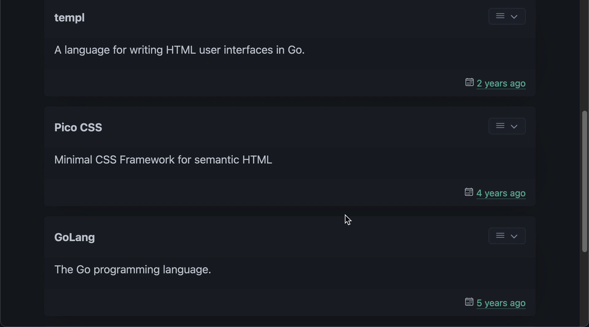

# go-templ-htmx-picocss-example

Example CRUD app based on [Go](https://github.com/golang/go) + [templ](https://github.com/a-h/templ) + [</>htmx](https://github.com/bigskysoftware/htmx) + [PicoCSS](https://github.com/picocss/pico) + [Ionicons](https://github.com/ionic-team/ionicons)




Features:
- Comfortable and flexible component based templates via [templ](https://github.com/a-h/templ)
- CRUD functionality
- Modal windows
- Error handling on user interface side
- Infinite scroll (Lazy Loading)
- User frendly interface
- Preserve static files

## Develop

Available makefile actions:
```sh
% make
Usage:  make COMMAND

Commands:
  help           Display help
  tools          Install github.com/a-h/templ/cmd/templ@latest
  get-deps       Download go dependencies
  generate       Compile templ files
  build          Compile templ files and build application
  start          Build and start application
  get-air        Install live reload server github.com/cosmtrek/air@latest
  air            Build and start application in live reload mode via air
  build-docker   Build Docker container image with this app
  run-docker     Run Docker container image with this app
```

## Local Development Setup

To get started, follow these steps:

1) Run `make tools` to install the necessary tools.
2) Run `make start` to download go dependencies, compile templ files, build application and finally start application.
```sh
% make tools
go install github.com/a-h/templ/cmd/templ@latest
% make start
go mod download
~/go/bin/templ generate
(✓) Complete [ updates=7 duration=13.893847ms ]
go run ./cmd/app
Starting web interface on port: 8089
```

You should now be able to access application in your web browser at http://localhost:8089
